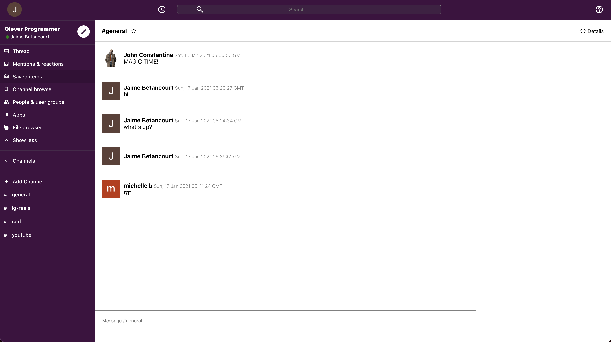

# slack-clone-app

This is a Slack clone application built with ReactJS, Material UI, and Firebase

## How to use

Clone the repo and use npm to install dependencies.

```bash
npm install
```

OR

Visit: https://slack-clone-app-6da0b.web.app/room/7eniEFMviUhEEWFRQ5ag

## Screenshots



## Authors and acknowledgment

This application was created using a YouTube video by Clever Programmer.

YouTube video: https://www.youtube.com/watch?v=Oo4ziTddOxs

## License

[MIT](https://choosealicense.com/licenses/mit/)
